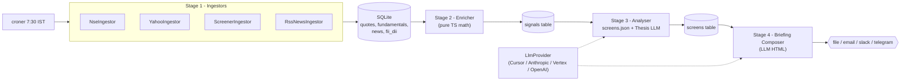

# Market Pulse AI

A personal morning-briefing agent for Indian stock markets (NSE/BSE).
**Not** an auto-trader — every order is still placed by you. The system is a
modular pipeline that runs every weekday at 7:30 AM IST and emails you a
short, actionable briefing before market open.

> **Status:** Phase 0 (foundation). The repo currently ships the skeleton —
> typed pipeline, swappable ingestor + LLM provider interfaces, SQLite
> schema, and a CLI. Real ingestors and AI thesis generation land in
> Phases 1 → 4. See [the roadmap](#roadmap).

---

## Why this exists

Most retail dashboards either drown you in data or hide behind a paywall.
Market Pulse AI takes the opposite approach: it pulls only the inputs that
actually move your decisions, runs them through repeatable screens, and asks
an LLM to write a short thesis for the 3–5 most interesting setups. You get
one focused email per morning.

What it does daily:

- Pulls overnight F&O data, FII/DII activity, and global cues
- Screens your watchlist against rules you control (`config/screens.json`)
- Summarises any earnings or news for your holdings
- Surfaces 3–5 actionable ideas, each with a thesis, entry zone, stop, and target

Full product spec: regenerate `market-pulse-ai-spec.docx` by running
`node new.cjs` (the source of truth for requirements lives in that script).

---

## Architecture

A four-stage pipeline. Each stage writes its output to SQLite, so any stage
can be re-run independently for debugging or backtesting.



Two abstractions keep the system portable:

| Interface       | Purpose                                                   | Phase 0 default                                   |
| --------------- | --------------------------------------------------------- | ------------------------------------------------- |
| `Ingestor`      | Pluggable data sources (`NSE`, `Yahoo`, `Screener`, `Kite`) | none registered yet — wired up in Phase 1         |
| `LlmProvider`   | Pluggable LLM backend (`cursor-agent`, `anthropic`, `vertex`, `openai`) | `cursor-agent` (uses your existing subscription)  |

---

## Tech stack

- **Runtime:** Node.js 20 + TypeScript (strict, ESM)
- **Package manager:** pnpm 10
- **Storage:** SQLite via `better-sqlite3`
- **Scheduling:** `croner` (timezone-aware)
- **Validation:** `zod` everywhere — env, configs, LLM outputs
- **Logging:** `pino` (pretty in dev, JSON in prod)
- **CLI:** `commander`
- **Lint + format:** Biome
- **Tests:** Vitest

---

## Quickstart

```bash
# 1. Install dependencies
pnpm install

# 2. Configure
cp .env.example .env
# edit .env - the defaults work, but set BRIEFING_DELIVERY etc. to taste

# 3. Initialise the database
pnpm migrate

# 4. Sanity-check your runtime/config (no secrets are printed)
pnpm cli doctor

# 5. Run the (currently stub) pipeline end-to-end
pnpm run-all
# -> writes briefings/briefing-YYYY-MM-DD.html
```

### CLI reference

```bash
pnpm cli --help            # top-level help

pnpm cli migrate           # apply DB migrations
pnpm cli ingest            # stage 1 - pull data
pnpm cli ingest -s RELIANCE,INFY
pnpm cli enrich            # stage 2 - compute signals
pnpm cli screen            # stage 3 - apply screens
pnpm cli screen -n momentum_breakout
pnpm cli brief             # stage 4 - compose + deliver briefing
pnpm cli brief --delivery file
pnpm cli run-all           # all four stages in order
pnpm cli doctor            # config diagnostics
```

All commands accept `-d 2026-04-30` to target a specific trading date
(useful for backtesting and replay).

---

## Configuration

Three places, in order of precedence:

1. **`.env`** — secrets and runtime knobs (see `.env.example`).
   Validated via `zod` at process start; bad values fail fast.
2. **`config/*.json`** — committed configuration:
   - [`watchlist.json`](config/watchlist.json) — symbols to highlight
   - [`screens.json`](config/screens.json) — screen criteria DSL
   - [`portfolio.json`](config/portfolio.json) — manual holdings (Phase 1–4;
     replaced by Kite sync in Phase 5)
3. **CLI flags** — per-invocation overrides like `-d` or `--delivery`.

### Switching the LLM provider

Set `LLM_PROVIDER` in `.env`:

| Value          | Requires                                                  | Notes                                       |
| -------------- | --------------------------------------------------------- | ------------------------------------------- |
| `cursor-agent` | `cursor-agent` CLI installed and signed in (default)      | Uses your Cursor subscription, no API key   |
| `anthropic`    | `ANTHROPIC_API_KEY`                                       | Adapter implemented in Phase 3              |
| `vertex`       | `GOOGLE_VERTEX_PROJECT` + `GOOGLE_APPLICATION_CREDENTIALS` | Gemini via Vertex AI, implemented in Phase 3 |
| `openai`       | `OPENAI_API_KEY`                                          | Adapter implemented in Phase 3              |
| `mock`         | Nothing                                                   | Deterministic stub for tests                |

Adding a new provider: implement [`LlmProvider`](src/llm/types.ts) and
register it in [`src/llm/factory.ts`](src/llm/factory.ts). Nothing else
changes.

### Switching the market data provider

Set `MARKET_DATA_PROVIDER`:

- `free` (default) — NSE public JSON endpoints + Yahoo Finance + Screener.in
- `kite` — Zerodha Kite Connect (requires `KITE_API_KEY` / `KITE_API_SECRET`
  / `KITE_ACCESS_TOKEN`; ingestor implemented in Phase 5)

---

## Repo layout

```
market-pulse-ai/
  src/
    agents/         # one module per pipeline stage
    ingestors/      # data-source connectors (NSE, Yahoo, Screener, Kite, ...)
    enrichers/      # signal computation (Phase 1)
    analysers/      # screen engine + thesis generator (Phase 2/3)
    briefing/       # HTML composer + delivery (Phase 4)
    db/             # schema.sql + migrations + prepared queries
    llm/            # LlmProvider interface + adapters
    config/         # env loader (zod-validated)
    portfolio/      # holdings tracker (Phase 4)
    backtest/       # historical replay (Phase 2)
    types/          # shared domain types
    cli.ts          # CLI entry
    constants.ts    # SEBI disclaimer, rate limits, etc.
    logger.ts       # pino logger
  config/           # committed JSON configs (watchlist, screens, portfolio)
  scripts/          # build helpers + ops scripts
  tests/            # vitest unit/integration tests
  data/             # SQLite DB + caches (git-ignored)
  briefings/        # generated HTML briefings (git-ignored)
```

---

## Development

```bash
pnpm dev                # tsx watch on src/cli.ts (passes args after --)
pnpm typecheck          # tsc --noEmit
pnpm lint               # biome check
pnpm lint:fix           # biome check --write
pnpm format             # biome format --write
pnpm test               # vitest run
pnpm test:watch         # vitest --watch
pnpm test:coverage      # vitest run --coverage
pnpm build              # tsc -> dist/  (also copies SQL assets)
```

### Conventions

- **Strict TypeScript everywhere.** `noUncheckedIndexedAccess` is on.
- **Named exports only.** Default exports are banned.
- **No business logic in `cli.ts`.** It is a thin orchestrator.
- **All env access through `config`.** Never read `process.env` directly.
- **All LLM JSON validated by zod.** `LlmJsonValidationError` makes failures
  loud.

---

## Roadmap

| Phase | Theme                | Highlights                                                                 |
| ----- | -------------------- | -------------------------------------------------------------------------- |
| 0     | Foundation (this)    | Repo scaffold, types, DB schema, CLI, LLM provider abstraction             |
| 1     | Ingest + enrich      | NSE/Yahoo/Screener/RSS ingestors; SMA/EMA/RSI/ATR/volume signals           |
| 2     | Screening + backtest | JSON screen DSL; momentum / value / FII screens; 6-month backtest harness  |
| 3     | AI layer             | LLM thesis generator + briefing composer; sentiment scoring; zod-validated |
| 4     | Delivery             | Cron schedule (7:30 / 15:30 / Sat 8:00); Gmail / Slack / Telegram delivery |
| 5     | Real-time + Kite     | Kite Connect ingestor; intraday watchlist alerts; portfolio sync           |

---

## Disclaimer

> This software is provided for **personal research and educational use
> only**. It is **not** investment advice and is **not** a SEBI-registered
> research analyst product. The authors are not responsible for any
> financial decisions made using this software. **All trading decisions and
> their consequences are solely the user's responsibility.**

The system is designed to stay outside the SEBI Algo Trading framework: no
automated order routing, no signal redistribution, no third-party hosting of
your recommendations. Keep it that way.

---

## License

[MIT](LICENSE).
