# Market Pulse AI

[](https://github.com/Shubhamjain2908/market-pulse-AI/actions/workflows/ci.yml)

A personal morning-briefing agent for Indian stock markets (NSE/BSE).
**Not** an auto-trader — every order is still placed by you. The system is a
modular pipeline that runs every weekday at 8:45 AM IST and emails you a
short, actionable briefing before market open.

> **Status:** Phases 0–5 shipped (Delivery included). **Phase 6 — Market Regime
> Filter** shipped: deterministic daily regime (BULL_TRENDING /
> BEAR_TRENDING / CHOPPY / CRISIS) from multi-factor signals, optional LLM
> one-line narrative (plain text; templated fallback on failure),
> `regime_daily` + `regime_strategy_gate` tables, per-screen and per-agent
> gating with size multipliers, regime card + change banner + rule-based FII/DII
> flow attribution (5-session cash, no extra LLM) in the HTML briefing,
> and wiring in `pnpm daily` / `pnpm run-all` before screening and thesis
> generation. **Momentum screener (multi-factor)** shipped: `mom_*` signals +
> weekly ranker / rebalance into `paper_trades` (`momentum_mf`), regime-gated
> entries with sector cap + earnings blackout, HTML **Momentum screener** card
> (rank decay + open-book monitor), thesis/portfolio context that **merges latest
> values per signal name** (so weekday technical enrich does not drop stale
> `mom_rank` / `mom_false_flag`), code-enforced **confidence ≤ 5** when
> `mom_false_flag = 1`, **hard-block `momentum_mf` entries** when flagged,
> portfolio guardrails (rank-decay EXIT, block ADD on false flag), and **Sunday 08:00**
> rebalance followed by a skip-AI briefing that
> includes the rebalance summary (`pnpm cli momentum-rebalance --brief` for the
> same compose + deliver path). **Quality-GARP screener (`quality_garp`)** shipped (v1):
> fundamentals-backed dispatcher in [`stock-screener.ts`](src/analysers/stock-screener.ts)
> (2-year ROE ≥ 18%, revenue growth ≥ 15%, PE/PB ceilings, RSI dip + near SMA50, promoter
> stability), regime gates with **CHOPPY size 0.75×**, full `matched_criteria` on `screens`,
> and thesis **Quality-GARP context** (sector, PEG snapshot, moat prompt) — candidates flow
> into gated AI picks (`AI_PICK` paper trades use default trailing stops). See
> [Quality-GARP screener](#quality-garp-screener). **Adaptive trailing stops (paper trades)** shipped end-to-end:
> ATR14-based upward-only trailing on `paper_trades`, EOD bar-by-bar evaluator
> (`runEvaluatePaperTrades`), `trailing_stop_log` audit trail + additive
> `exit_reason`, HTML **Paper trades · trailing stops** block (above the regime
> card), optional LLM post-mortem on `STOPPED_OUT`, and integration tests
> (merge gates + §9.2/§9.3). **Catalyst-driven entry (`catalyst_entry`)** shipped:
> pre-earnings sleeve (5–14 calendar days to `earnings_calendar.expected_date`),
> regime-gated custom screener ([`src/analysers/catalyst-screener.ts`](src/analysers/catalyst-screener.ts)
> + dispatcher in [`stock-screener.ts`](src/analysers/stock-screener.ts)), catalyst thesis context
> with top-2 news headlines and **code-enforced confidence ≤ 6**, and **`paper_trades` with
> `stop_type='fixed'`** (96% stop / 108% target, `max_hold_days = days_to_earnings + 2`) —
> evaluator skips ATR trailing for fixed rows (migration **`0016`**). See
> [Catalyst-driven entry](#catalyst-driven-entry-pre-earnings) and
> [Adaptive trailing stops](#adaptive-trailing-stops-paper-trades). **Report quality Phase 1**
> shipped: NSE holiday/weekend guard (no pointless ingest when cash market is
> closed), Market Mood shows Nifty Δ / India VIX / dated FII-DII with `[prev]`
> labels, explicit AI Picks section states (skipped / holiday / empty / all
> failed), and broader thesis candidates (screens, alerts, portfolio
> drawdown). Phase 5 adds Zerodha Kite Connect
> integration, a per-holding LLM-driven HOLD/ADD/TRIM/EXIT analyser, an
> intraday LTP scanner, four additional built-in screens (RSI Oversold
> Bounce, Golden Cross, Volume Breakout, Dividend Compounder), and a
> single-command `pnpm daily` that runs the entire pipeline end-to-end and
> produces a briefing with a "My Portfolio" section showing each
> position's recommended action. Phase 4 adds croner scheduling
> (08:45 / 16:30 weekdays, Sat 08:00 IST), Gmail SMTP delivery via
> nodemailer, and stop-loss breach detection alerts. Earlier phases provide: a JSON-driven
> screen engine, first-class watchlist alerts, a backtest harness, LLM
> sentiment scoring, AI thesis generation, and an AI-composed HTML
> briefing. Supports Cursor Agent, Anthropic, OpenAI, and Vertex AI
> (Gemini) as LLM backends. See [the roadmap](#roadmap), [Market regime filter](#market-regime-filter-phase-6), [Momentum screener](#momentum-screener-multi-factor), [Quality-GARP screener](#quality-garp-screener), [Catalyst-driven entry](#catalyst-driven-entry-pre-earnings), and [Adaptive trailing stops](#adaptive-trailing-stops-paper-trades).

---

## Why this exists

Most retail dashboards either drown you in data or hide behind a paywall.
Market Pulse AI takes the opposite approach: it pulls only the inputs that
actually move your decisions, runs them through repeatable screens, and asks
an LLM to write a short thesis for the 3–5 most interesting setups. You get
one focused email per morning.

What it does daily:

- Pulls overnight F&O data, FII/DII activity, NSE ETF iNAV snapshots (held ETF universe), and global cues
- Classifies the **market regime** from signals (trend, VIX, FII, breadth), optionally asks an LLM for a one-sentence regime narrative, and applies **strategy gates** (which screens and agents run, and at what relative size)
- Screens your watchlist against rules you control (`config/screens.json`), including **Quality-GARP** (fundamentals + technical dip) and **catalyst_entry** (pre-earnings) custom sleeves
- Summarises any earnings or news for your holdings
- Surfaces 3–5 actionable ideas, each with a thesis, entry zone, stop, and target (when `ai_picks_generation` is allowed for the current regime)
- Forward-tests ideas in **`paper_trades`**: after each `pnpm daily` run, `runEvaluatePaperTrades` walks **bar-by-bar** OHLC — **adaptive ATR trailing** for `stop_type='trailing'` (AI picks, portfolio adds, `momentum_mf`) and **static SL/TP/time-stop only** for `stop_type='fixed'` (`catalyst_entry`, no `trailing_stop_log` rows); outcomes feed the **Signal performance** card; trailing activity appears under **Paper trades · trailing stops** when applicable
- Maintains an optional **multi-factor momentum** book (`momentum_mf` paper trades): weekly ranks and rebalance outputs surface in the briefing’s **Momentum screener** block when applicable; daily workflows reuse merged `mom_*` + technical snapshots for thesis and portfolio analysis

Full product spec: regenerate `market-pulse-ai-spec.docx` by running
`node new.cjs` (the source of truth for requirements lives in that script).

---

## Architecture

A four-stage pipeline. Each stage writes its output to SQLite, so any stage
can be re-run independently for debugging or backtesting.

```mermaid
flowchart LR
    Cron["croner 8:45 IST"] --> Ingest
    subgraph Ingest [Stage 1 - Ingestors]
        NSE[NseIngestor]
        Yahoo[YahooIngestor]
        Screener[ScreenerIngestor]
        RSS[RssNewsIngestor]
    end
    Ingest --> DB[("SQLite<br/>quotes, fundamentals,<br/>news, fii_dii")]
    DB --> Enrich["Stage 2 - Enricher<br/>(pure TS math)"]
    Enrich --> SignalsDB[("signals table")]
    SignalsDB --> Regime["Regime<br/>signals + classify<br/>+ regime_daily"]
    Regime --> Analyse["Stage 3 - Analyser<br/>gated screens + Thesis LLM"]
    Analyse --> ScreensDB[("screens table")]
    ScreensDB --> Brief["Stage 4 - Briefing Composer<br/>(LLM HTML + regime card)"]
    Brief --> Deliver{{"file / email / slack / telegram"}}
    LlmAbstraction["LlmProvider<br/>(Cursor / Anthropic / Vertex / OpenAI)"] -.-> Regime
    LlmAbstraction -.-> Analyse
    LlmAbstraction -.-> Brief
```



Two abstractions keep the system portable:

| Interface       | Purpose                                                   | Default                                           |
| --------------- | --------------------------------------------------------- | ------------------------------------------------- |
| `Ingestor`      | Pluggable data sources (`NSE`, `Yahoo`, `Screener`, `Kite`) | Yahoo + NSE + Screener + RSS (free tier)          |
| `LlmProvider`   | Pluggable LLM backend (`cursor-agent`, `anthropic`, `vertex`, `openai`) | `cursor-agent` (uses your existing subscription)  |

---

## Tech stack

- **Runtime:** Node.js 22 + TypeScript (strict, ESM)
- **Package manager:** pnpm 10
- **Storage:** SQLite via `better-sqlite3`
- **Scheduling:** `croner` (timezone-aware)
- **Validation:** `zod` everywhere — env, configs, LLM outputs
- **Logging:** `pino` (pretty in dev, JSON in prod)
- **CLI:** `commander`
- **Lint + format:** Biome
- **Tests:** Vitest

---

## Quickstart

```bash
# 1. Install dependencies
pnpm install

# 2. Configure
cp .env.example .env
# edit .env - the defaults work, but set BRIEFING_DELIVERY etc. to taste

# 3. Initialise the database
pnpm migrate

# 4. Sanity-check your runtime/config (no secrets are printed)
pnpm cli doctor

# 5. (Optional) Connect Zerodha Kite for live portfolio analysis
pnpm kite-login
# -> opens the Kite login URL, prompts for the request_token,
#    persists access_token to .env. Re-run daily after ~6 AM IST.

# 6. (Once) seed strategy gates after migrate — maps screens/agents to regimes
pnpm regime:seed-gates

# 7. The single-command morning run
pnpm daily
# -> portfolio sync + stop-loss (optional) → ingest → enrich → regime agent →
#    gated screen → sentiment → gated AI thesis → portfolio analysis → HTML briefing
# -> writes briefings/briefing-YYYY-MM-DD.html with regime card + "My Portfolio"
#    section for every holding (HOLD / ADD / TRIM / EXIT + reason).

# Variations
pnpm daily --skip-portfolio   # skip the Kite branch entirely
pnpm daily --skip-ai          # no LLM calls (regime uses templated narrative; fast mode)
```

### CLI reference

```bash
pnpm cli --help            # top-level help

# Pipeline stages
pnpm cli migrate           # apply DB migrations
pnpm cli ingest            # stage 1 - pull data
pnpm cli ingest -s RELIANCE,INFY
pnpm cli enrich            # stage 2 - compute signals
pnpm cli screen            # stage 3 - run screens + alert scan
pnpm cli screen -n momentum_breakout
pnpm cli backtest -s 2025-10-01 -e 2026-04-30 -h 10  # historical replay
pnpm cli backtest -s 2025-10-01 -e 2026-04-30 -n momentum_breakout
pnpm cli backtest-option-a --strategy all --from 2023-01-01 --to 2026-03-31  # Option A (default --regime-source proxy); --regime-source daily needs regime_daily ≥80%; add --verbose for timings
pnpm exec tsx scripts/audit-regime-history.mts --from 2023-01-01 --to 2026-03-31  # persisted vs raw score regime (why no BULL?)
pnpm backtest:option-a -- --strategy momentum-mf --dry-run
pnpm backtest:option-a -- --strategy momentum-mf --sweep-initial-stop --dry-run  # Phase 1 initial-ATR table [1.5,2,2.5,3]
pnpm backtest:option-a -- --strategy momentum-mf --sweep-lock-in --dry-run      # Phase 2 lock-in 3×3 (initial fixed 2.5×)
pnpm exec tsx scripts/audit-atr-alignment.mts   # pre-deploy: signals.atr_14 vs backtest Wilder ATR
pnpm cli sentiment         # score news headlines via LLM
pnpm cli thesis            # generate AI theses for top-signal stocks
pnpm cli brief             # stage 4 - compose + deliver briefing
pnpm cli evaluate          # paper-trade trailing evaluation (bar-by-bar; --skip-ai skips STOPPED_OUT post-mortems)

# Momentum screener (multi-factor rank + paper portfolio)
pnpm cli momentum-rank              # Phase 4.1: write mom_* signals (composite z-score, rank, false-flag, …)
pnpm cli momentum-rank -s SYM1,SYM2 # optional universe override
pnpm cli momentum-rebalance         # Phase 4.2: regime gate → rank exits → entries (sector cap + blackout)
pnpm cli momentum-rebalance --skip-ranker   # use existing mom_rank rows for session (no ranker pass)
pnpm cli momentum-rebalance --skip-thesis  # skip LLM entry thesis (paper sizing from ATR + hard stop; backfills / no API key)
pnpm cli momentum-rebalance --brief         # after rebalance: compose skip-AI briefing + rebalance summary + deliver (same idea as Sunday scheduler)

# One-shot pipelines
pnpm cli run-all           # ingest → enrich → regime → gated screen → sentiment → thesis → brief
pnpm cli daily             # full workflow + Kite portfolio sync + per-holding LLM analysis

# Phase 5 — Zerodha Kite + portfolio
pnpm cli kite-login        # interactive: refresh access_token (daily)
pnpm cli portfolio-sync    # snapshot current holdings to DB
pnpm cli portfolio-analyse # LLM-driven action recommendation per holding
pnpm cli portfolio-analyse -s INFY,HDFCBANK
pnpm cli portfolio-analyse -j 12    # override parallel calls for speed/tuning
pnpm cli scan              # one-shot intraday LTP refresh + live alerts
                           # (cron every 5-15 min during market hours)
pnpm cli schedule          # start built-in croner schedule (Asia/Kolkata):
                           # weekdays 08:45 + 16:30, Saturday 08:00,
                           # Sunday 06:00 (Yahoo momentum earnings calendar),
                           # Sunday 07:30 (weekly DB cleanup: briefings 90d, signals 730d),
                           # Sunday 07:45 (COMEX gold COT via pnpm cot:gold),
                           # Sunday 08:00 (momentum rank + rebalance + skip-AI briefing w/ rebalance summary + deliver)
pnpm cli schedule --run-now

pnpm cli doctor            # config diagnostics (no secrets)

# Phase 6 — Market regime filter
pnpm regime-signals        # print signal inputs + score buckets (validation)
pnpm regime                # classify + LLM narrative (or templated fallback) → regime_daily
pnpm regime --no-narrative # skip LLM; templated fallback narrative only (still upserts regime_daily)
pnpm regime:classify       # deterministic classification → regime_daily (narrative null)
pnpm regime:gate-summary   # allowed strategies + multipliers for regime on -d date
pnpm regime:seed-gates      # upsert config/strategy-gates.json → regime_strategy_gate
pnpm regime:backfill        # historical regime_daily backfill script
```

All commands accept `-d 2026-04-30` to target a specific trading date
(useful for backtesting and replay).

### Verifying the LLM is configured

`scripts/smoke-llm.mts` runs three calls of escalating complexity (text →
small JSON → realistic thesis prompt) so you can confirm the active `LLM_PROVIDER`
(including Vertex / Gemini) is wired up before kicking off a full run:

```bash
pnpm tsx scripts/smoke-llm.mts
# -> ✓ text — …
# -> ✓ json — …
# -> ✓ thesis — …
# -> LLM smoke test passed.
```

### How long does `pnpm daily` take?

Rough breakdown:

- **Portfolio analysis** — by default, a **trigger gate** decides whether each holding gets a full LLM JSON review (deep unrealised loss, recent alerts/news/screens, or stretched technicals). Otherwise the row is a deterministic **lite snapshot** (token-efficient). Set `PORTFOLIO_ANALYSIS_DISABLE_LITE=1` for legacy behaviour (full LLM on **every** holding). Until recently these ran **strictly one after another**, so a large book dominates wall-clock time when every row is full LLM (for example ~88 holdings × ~10 s each with Cursor Agent ≈ **15 minutes** for this stage alone).
- **Parallelism** — set `PORTFOLIO_ANALYSIS_CONCURRENCY` (default **8**) so Vertex/Gemini processes multiple holdings at once. Expect the portfolio stage to shrink to on the order of **⌈N / concurrency⌉ × (latency per call)** — often **~2–6 minutes** for 80+ names at concurrency 8 and ~3–8 s per Flash call, depending on quota and prompt size. If Vertex returns `429` / rate-limit errors, lower concurrency.
- **Other LLM work** — batched news sentiment, up to five watchlist theses, optional mood narrative: typically **~1–4 minutes** combined on Vertex Flash (highly variable).

---

## Configuration

Three places, in order of precedence:

1. **`.env`** — secrets and runtime knobs (see `.env.example`).
   Validated via `zod` at process start; bad values fail fast.
2. **`config/*.json`** — committed configuration:
   - [`watchlist.json`](config/watchlist.json) — symbols to highlight
   - [`screens.json`](config/screens.json) — screen criteria DSL
   - [`strategy-gates.json`](config/strategy-gates.json) — which screens / meta-strategies (e.g. `ai_picks_generation`) are allowed per regime and optional **size multipliers** (seed into `regime_strategy_gate` via `pnpm regime:seed-gates`)
   - [`momentum-config.json`](config/momentum-config.json) — momentum strategy id, regime gate, portfolio slots, exit rank threshold, factor weights, blackout / sector caps, position sizing (`atr_multiplier` **2.5**, `lock_in_threshold_pct` **18**, `tightened_multiplier` **1.5** — shared by live evaluate, momentum rebalance, and backtest defaults)
   - [`momentum-universe.json`](config/momentum-universe.json) — bucketed symbol union for the momentum ranker (~150-name screenable list)
   - [`portfolio.json`](config/portfolio.json) — manual holdings, used
     when `PORTFOLIO_SOURCE=manual`. Live Kite sync is the default in
     Phase 5 (`PORTFOLIO_SOURCE=kite`); the analyser doesn't care which
     source produced the rows.
3. **CLI flags** — per-invocation overrides like `-d` or `--delivery`.

### Switching the LLM provider

Set `LLM_PROVIDER` in `.env`:

| Value          | Requires | Notes |
| -------------- | -------- | ----- |
| `cursor-agent` | `CURSOR_API_KEY` + `cursor-agent` CLI on `PATH` | Uses Cursor Agent v3; monthly request caps apply |
| `vertex`       | `GOOGLE_VERTEX_PROJECT`; ADC via `GOOGLE_APPLICATION_CREDENTIALS` **or** `gcloud auth application-default login` | **Recommended for large portfolios** — Gemini on Vertex AI, usage billed monthly ([model reference](https://cloud.google.com/vertex-ai/generative-ai/docs/learn/model-versions)). Default model id: `gemini-2.5-flash` (env `VERTEX_MODEL`). For heavier reasoning use `gemini-2.5-pro` |
| `anthropic`    | `ANTHROPIC_API_KEY` | Claude via REST |
| `openai`       | `OPENAI_API_KEY` | GPT via REST |
| `mock`         | Nothing | Deterministic stub for tests |

Adding a new provider: implement [`LlmProvider`](src/llm/types.ts) and
register it in [`src/llm/factory.ts`](src/llm/factory.ts). Nothing else
changes.

### Screen DSL

Screens are evaluated against a unified signal lookup that pulls from three
sources transparently:

| Source                    | Signals                                                                      |
| ------------------------- | ---------------------------------------------------------------------------- |
| `signals` table (technical + optional momentum) | Technical (`pnpm cli enrich`): `close`, `sma_20`, `sma_50`, `sma_200`, `ema_9`, `ema_21`, `rsi_14`, `atr_14`, `volume_ratio_20d`, `pct_from_52w_high`, `pct_from_52w_low`. **Momentum factors + blackout** (same enrich path, momentum-universe symbols): `mom_12_1_return`, `mom_relative_strength_ba`, `mom_volume_breakout_flag`, `mom_earnings_blackout`. **Momentum rank** (`pnpm cli momentum-rank`): `mom_rank`, `mom_composite_score`, `mom_false_flag`, `mom_rank_excluded`. |
| `fundamentals` table      | `pe`, `pb`, `peg`, `roe`, `roce`, `debt_to_equity`, `revenue_growth_yoy`, `profit_growth_yoy`, `promoter_holding_pct`, `promoter_holding_change_qoq`, `dividend_yield`, `market_cap` |
| `fii_dii` table (computed) | `fii_net`, `dii_net`, `fii_net_5d_sum`, `dii_net_5d_sum`, `fii_net_streak_days`, `dii_net_streak_days` |

Operators: `eq`, `neq`, `gt`, `gte`, `lt`, `lte`, `between` (tuple value),
`gt_signal` / `lt_signal` (compares two signals — e.g. `close > sma_50`).

Edit [`config/screens.json`](config/screens.json) and re-run
`pnpm cli screen`. No code changes required for DSL screens.

**Custom dispatchers** (not the generic engine): **`quality_garp`** and **`catalyst_entry`**
are listed in `screens.json` for labels/regime seeding but evaluated in
[`src/analysers/stock-screener.ts`](src/analysers/stock-screener.ts) — dedicated SQL paths,
regime gates from [`config/strategy-gates.json`](config/strategy-gates.json), and full
`matched_criteria` persisted to `screens`.

### Backtest

**Screen replay** — `pnpm cli backtest -s 2025-10-01 -e 2026-04-30 -h 10` replays every
configured screen against historical EOD data:

- Each session in the window where a screen matches becomes a trade.
- Entry = next-day close. Exit = close after `holdDays` sessions.
- Per run we record total trades, winning/losing, hit rate, mean/median
  return, max return, min return, and worst single-trade drawdown.
- Results land in `backtest_runs` and `backtest_trades` tables for ad-hoc
  SQL analysis (`sqlite3 data/market-pulse.db`).

**Option A walk-forward** — `pnpm cli backtest-option-a --strategy all --from 2023-01-01 --to 2026-03-31`
(or `pnpm backtest:option-a -- ...`) runs `momentum_mf` and/or `ai_pick` rules with indicators computed **from `quotes` only** (no `signals` table). Momentum price factors use **`adj_close`** (aligned with live enrich). **Default `regime-source` is `proxy`:** a coarse 3-signal regime from `quotes` only (`src/backtest/regime-proxy.ts`) — no `regime_daily`, no FII/VIX, no 3-day persistence. The proxy gate requires **≥252** NSE `NIFTY_50` rows **strictly before** `--from`. Use **`--regime-source daily`** to require **`regime_daily`** covering ≥80% of benchmark trading days (historical enrich/FII still affects label quality). Extended aggregates are stored on `backtest_runs` (migration `0014`). Each closed leg persists **`backtest_trades.exit_reason`** (migration `0015`: stop vs target vs time vs rank/regime/window-end). Sweeps (momentum-mf only): **`--sweep-initial-stop`** over initial ATR `[1.5, 2.0, 2.5, 3.0]`; **`--sweep-lock-in`** over tightened mult × lock-in threshold (initial fixed **2.5×**). Production trailing parameters: **2.5× / 18% / 1.5×** in [`config/momentum-config.json`](config/momentum-config.json) (Phase 2 winners). `--dry-run` skips DB writes but still enforces the chosen regime gate. Each run prints JSON **`option-a:start`** plus per-strategy results (including zero-trade runs); **`--verbose`** logs engine time. GTT activation gates: [`docs/gtt-activation-criteria.md`](docs/gtt-activation-criteria.md).

**Live `regime_daily` vs backtest proxy** — Full classifier (`runRegimeClassifier` / `computeRegimeSignals`) uses VIX, FII, and `signals` breadth; persisted labels use **3-session** agreement (`applyPersistence`). The Option A **proxy** intentionally diverges for runnable backtests without historical enrich. Audit persisted rows: `pnpm exec tsx scripts/audit-regime-history.mts --from … --to …`.

### Switching the market data provider

Set `MARKET_DATA_PROVIDER`:

- `free` (default) — NSE public JSON endpoints + Yahoo Finance + Screener.in
- `kite` — adds Zerodha Kite Connect for live portfolio + LTP. EOD
  historical data still comes from Yahoo (Kite's historical API is a
  paid add-on we don't depend on).

### Connecting Zerodha Kite (Phase 5)

The portfolio analyser is the marquee Phase 5 deliverable: every morning
it builds a context (P&L, technicals, fundamentals, recent news, screens
fired, alerts) for each of your holdings and asks the LLM to pick exactly
one of `HOLD` / `ADD` / `TRIM` / `EXIT` with a 2-3 sentence thesis, bull/
bear points, the catalyst that triggered the call, and optional stop /
target levels.

To enable it:

1. Create a Kite Connect app at <https://kite.trade> ("My Apps" → "Create
   new app"). Note the API key, API secret, and the redirect URL you
   configured.
2. Fill these into `.env`:
   ```
   MARKET_DATA_PROVIDER=kite
   PORTFOLIO_SOURCE=kite
   KITE_API_KEY=...
   KITE_API_SECRET=...
   ```
3. Run the daily login dance:
   ```
   pnpm kite-login
   ```
   This opens the Kite login page, accepts either the bare
   `request_token` or the full redirect URL Zerodha sent you, exchanges
   it for an `access_token`, and idempotently writes the token into
   `.env`. Tokens expire at roughly 6 AM IST every day, so this is a
   once-per-morning step.
4. Run the briefing:
   ```
   pnpm daily
   ```
   The briefing now contains a "My Portfolio" section right under the
   market-mood banner, with every position's recommended action.
5. Optional automation:
   ```
   pnpm schedule
   ```
   Starts recurring jobs at 08:45 / 16:30 on weekdays and 08:00 on
   Saturdays (IST), using your configured delivery channel.

If you'd rather skip Kite entirely, leave `PORTFOLIO_SOURCE=manual` (the
default) and edit `config/portfolio.json`. Same downstream output —
just no live LTPs or day-change tracking.

### Intraday scanning (`mp scan`)

`pnpm scan` does a one-shot Kite quote fetch for the union of your
watchlist and current holdings, persists each tick to `intraday_quotes`,
and flags any symbol whose intraday move exceeds `--threshold` (default
`3` percent) as a live alert. Cron-friendly — the command exits on
completion, so a `*/10 * * * *` entry during market hours is enough.

### Gmail delivery (nodemailer)

Set in `.env`:

```
BRIEFING_DELIVERY=email
SMTP_HOST=smtp.gmail.com
SMTP_PORT=587
SMTP_USER=you@gmail.com
SMTP_PASS=<gmail-app-password>
SMTP_FROM=you@gmail.com
SMTP_TO=you@gmail.com
```

Use a Gmail **App Password** (free), not your account password.

### Stop-loss breach alerts

The workflow reads `stopLoss` values from `config/portfolio.json` and
compares them with latest known prices (Kite LTP preferred, fallback to
latest EOD close). Breaches are persisted to the `alerts` table with
kind `stop_loss_breach` and appear in the briefing's alerts section.

---

## Market regime filter (Phase 6)

A **meta-layer** on top of the existing pipeline: each open session gets a single **market regime** label with supporting scores and narrative, plus a **strategy gate matrix** so screening and thesis generation adapt when conditions are hostile.

**What gets classified**

- Deterministic **signals** (`src/enrichers/regime-signals.ts`): trend vs SMA200, VIX level and change, FII flows (including rolling sums on the trading calendar), breadth / A–D style inputs, gap risk, etc., rolled into bucket scores and a total in **[-16, +16]**.
- **Classifier** (`src/analysers/regime-classifier.ts`): CRISIS-style overrides (e.g. extreme VIX / gap), score bands → raw label, **3-day persistence** before flipping the persisted label, optional recovery paths — producing `BULL_TRENDING` | `BEAR_TRENDING` | `CHOPPY` | `CRISIS` plus `prev_regime`, `regime_age`, and breakdown fields.

**Persistence**

- Migration [`src/db/migrations/0006_regime_tables.sql`](src/db/migrations/0006_regime_tables.sql): `regime_daily` (one row per session with scores, narrative, prev/age) and `regime_strategy_gate` (strategy × regime × allowed × `size_multiplier`).
- Queries and seeding: [`src/db/regime-queries.ts`](src/db/regime-queries.ts), [`scripts/seed-regime-gates.mts`](scripts/seed-regime-gates.mts), driven by [`config/strategy-gates.json`](config/strategy-gates.json). **`isStrategyAllowed` is fail-closed:** a missing `(strategy_id, regime)` gate row → strategy **disallowed** (run `pnpm regime:seed-gates` after migrate).

**LLM narrative**

- [`src/agents/regime-agent.ts`](src/agents/regime-agent.ts) asks the configured `LlmProvider` for **one plain-text sentence** (deterministic regime in the payload is authoritative). If the LLM fails, a **templated fallback** narrative is stored so the row is always usable.

**Downstream behaviour**

- **Screen engine** ([`src/analysers/engine.ts`](src/analysers/engine.ts)): skips screens disallowed for the current regime; applies size multiplier into persisted match metadata (`__regime_meta`).
- **Stock screener** passes through the active regime; **thesis generator** skips `ai_picks_generation` when the gate says so ([`src/agents/thesis-generator.ts`](src/agents/thesis-generator.ts)).
- **Risk tooling** (`portfolio_exit_signals`, `trailing_stop_update`) stays on across regimes per config.
- **Briefing**: [`src/briefing/regime-card.ts`](src/briefing/regime-card.ts) renders a card + optional change banner; [`src/briefing/composer.ts`](src/briefing/composer.ts) loads `regime_daily` for the briefing session date (including weekend/holiday handling via last open session). **Pipeline audit:** each `daily-workflow` stage writes to `pipeline_runs`; if `enrich`, `regime`, or `screen` failed today, the brief degrades (banner only — screens, AI picks, portfolio, and momentum omitted; regime card shown only when regime succeeded). Email delivery sets `briefings.delivered_at` only after SMTP accepts ≥1 recipient.
- **FII/DII flow attribution** (rule-based, no LLM): [`getFlowAttribution`](src/db/queries.ts) sums the last up to **five cash-segment trading sessions** on or before the briefing date; [`classifyFlowAttribution`](src/briefing/composer.ts) maps rolling FII/DII nets (₹ crore) to **INSTITUTIONAL_ROTATION**, **BROAD_EXIT**, or **FII_ACCUMULATION** (thresholds in composer). **BALANCED** and windows with **&lt; 3 sessions** are suppressed. The block sits in the regime card **between the score tiles and the regime narrative**, with table + inline styles for email (juice-inlined from [`renderBriefing`](src/briefing/template.ts)).
- **ETF iNAV pricing** (rule-based, fail-open): [`fetchInavSnapshots`](src/ingestors/inav-fetcher.ts) runs after Yahoo snapshot ingest (before regime classify), reads NSE [`/api/etf`](https://www.nseindia.com/api/etf) for symbols in [`config/etf-exclusions.json`](config/etf-exclusions.json), persists [`inav_snapshots`](src/db/migrations/0018_inav_snapshots.sql). Briefing **ETF Pricing** section ([`etf-pricing-card.ts`](src/briefing/etf-pricing-card.ts)) shows **WARN** when held ETF premium **&gt; 0.5%**, **NOTE** when discount **&gt; 0.25%**; mid-band and missing NSE data produce no section.
- **COMEX gold COT** (weekly, fail-open): [`pnpm cot:gold`](scripts/cot-gold-fetch.ts) pulls CFTC disaggregated [`f_disagg.txt`](https://www.cftc.gov/dea/newcot/f_disagg.txt) (COMEX / `CMX` gold; managed-money as non-commercial proxy; columns resolved by CFTC header names). Stores [`cot_gold`](src/db/migrations/0019_cot_gold.sql). Regime card shows one line when **CROWDED_LONG** (managed-money net/OI **&gt; 35%**) or **CROWDED_SHORT** (managed-money **net short**, `mm_net &lt; 0`); **NEUTRAL** suppressed. Scheduled **Sunday 07:45 IST** before momentum rebalance (briefing-only; momentum rebalance does not read `cot_gold`).
- **Weekly DB cleanup** (Sunday **07:30 IST**): [`runWeeklyCleanup`](src/agents/weekly-cleanup.ts) deletes `briefings` older than **90 days** and `signals` older than **730 days** (2 years). Fail-open — errors are logged but do not block the 08:00 rebalance.
- **Regime quorum** (safety): [`prepareRegimeDaily`](src/analysers/regime-classifier.ts) refuses to persist `regime_daily` when any of five required inputs (Nifty vs SMA200, SMA200 slope, VIX, FII 20d, % above SMA200) is missing — the `regime` pipeline stage fails instead of silently scoring with nulls as zero.
- **Paper-trade cross-strategy dedup**: [`hasOpenPaperTradeForSymbol`](src/db/queries.ts) blocks new entries in [`paper-trade-writer.ts`](src/briefing/paper-trade-writer.ts) and [`momentum-rebalance.ts`](src/strategies/momentum-rebalance.ts) when **any** OPEN row exists for that symbol (any `signal_type`). CLOSED rows do not block. Briefing shows a warning when collisions occur.

**Orchestration**

- [`src/agents/daily-workflow.ts`](src/agents/daily-workflow.ts) and `pnpm cli run-all` run **ingest → enrich → regime → gated screen → gated thesis → paper-trade evaluate → briefing** (stage outcomes in `pipeline_runs`).

---

## Momentum screener (multi-factor)

A **regime-gated** momentum sleeve that ranks a configurable universe, writes **`mom_*`** rows into `signals`, and maintains open **`momentum_mf`** rows in **`paper_trades`** (weekly rebalance). It complements the existing watchlist screens and AI picks — not a live order router.

**Config**

- [`config/momentum-config.json`](config/momentum-config.json) — `strategy_id`, `regime_gate`, `portfolio_slots`, **`exit_rank_threshold`** (rank-decay exit), factor weights, earnings blackout window, `max_per_sector`, position sizing knobs.
- [`config/momentum-universe.json`](config/momentum-universe.json) — union of bucketed symbols fed to the ranker (override via `pnpm cli momentum-rank -s …` / rebalance `--symbols` when testing).

**CLI / code paths**

- **Signal enrich** — `pnpm cli enrich` → [`TechnicalEnricher`](src/enrichers/index.ts) plus [`enrichMomentumSignals`](src/enrichers/momentum-signals.ts) for the momentum universe: **`mom_12_1_return`**, `mom_relative_strength_ba`, `mom_volume_breakout_flag`, `mom_earnings_blackout`. Requires sufficient quote history in SQLite for 12–1 style momentum math.
- **Ranker** — `pnpm cli momentum-rank` → [`src/rankers/momentum-ranker.ts`](src/rankers/momentum-ranker.ts) reads those factor rows for `asOf` and writes **`mom_rank`**, `mom_composite_score`, **`mom_false_flag`**, `mom_rank_excluded`.
- **Rebalance** — `pnpm cli momentum-rebalance` → [`src/strategies/momentum-rebalance.ts`](src/strategies/momentum-rebalance.ts): optional embedded ranker pass, liquidations when regime ∉ gate, rank-decay exits, new entries with sector cap + blackout checks + **`mom_false_flag` hard-block** (`falseFlagBlocked` counter) + **`atr_14` required** (`atrMissingSkipped` when missing/≤0; no 2% proxy) + **cross-strategy dedup** (`crossStrategyBlocked` when another OPEN `paper_trades` row exists); optional LLM entry thesis (false-flag thesis confidence is clamped in-strategy when thesis runs).

Shortcuts: `pnpm momentum:rank` / `pnpm momentum:rebalance` (wrappers around the same CLI commands).

- **Daily workflow** — [`src/agents/daily-workflow.ts`](src/agents/daily-workflow.ts) runs Yahoo momentum earnings refresh on **Sunday** IST ([`syncMomentumEarningsCalendarFromYahoo`](src/ingestors/yahoo/earnings-ingestor.ts) → [`replaceMomentumEarningsCalendarForSymbol`](src/db/momentum-queries.ts); **empty Yahoo response retains** existing `earnings_calendar` rows); [**`applyMomentumRegimeGateExits`**](src/strategies/momentum-rebalance.ts) after regime classification on trading days.

**Historical session (quotes only ≠ momentum factors)** — `pnpm momentum:backfill-universe` loads **quotes** for the momentum universe; it does **not** insert `mom_12_1_return` or other factor rows. For a past calendar date `D`: ensure quotes cover the lookback window, then run **`pnpm cli enrich -d D`**, then **`pnpm cli momentum-rank -d D`**, then **`pnpm cli momentum-rebalance -d D`** (or your usual pipeline).

**Signal snapshots (important)**

Technical enrich runs **daily**; momentum ranks are typically **weekly** (rebalance session). Lookups use **`getLatestSignalsMap`** ([`src/agents/portfolio-trigger.ts`](src/agents/portfolio-trigger.ts)): **latest row per `signals.name`** on or before the as-of date (window function), then merged into one map. That way **`mom_rank` / `mom_false_flag` do not disappear** after a newer RSI-only session row is written.

**Thesis generator**

- Stock context adds a **Momentum factor snapshot** when gate fields exist ([`buildMomentumContextAppend`](src/agents/thesis-generator.ts)); the thesis system prompt can include a **momentum addendum** for factor-by-factor narrative and false-momentum wording.
- If **`mom_false_flag === 1`** in the merged map, persisted thesis **`confidence`** is **`min(LLM, 5)`** after the LLM returns (not prompt-only).

**Portfolio analyser**

- [`applyMomentumPortfolioGuardrails`](src/agents/portfolio-analyser.ts): **`mom_rank` > exit threshold** → **EXIT** (unless already EXIT); **`mom_false_flag === 1`** downgrades **ADD** → **HOLD** with an explicit guardrail suffix. Uses the same merged signal map as lite/full paths.

**Briefing**

- [`src/briefing/momentum-card.ts`](src/briefing/momentum-card.ts) — **Momentum screener** card in the HTML brief: **after Screens fired today, before Watchlist alerts** (then **Portfolio**). That order keeps the block visible; it is omitted only when there is no rebalance summary and no open `momentum_mf` trades / rank-decay rows to show. **Last rebalance** counters when the sleeve ran (**`regimeAllowed`**); a clear **gated / missing regime** message when it did not; **rank decay** highlight for ranks in the configured amber band; **monitor** table for open `momentum_mf` trades ( **`False flag`** shows **—** when `mom_false_flag` is absent).

**Rebalance summary → HTML**

- Each **`runMomentumRebalance`** upserts a row into **`momentum_rebalance_briefing`** (migration **`0010`**) keyed by **`calendar_date`**. [`composeBriefing`](src/briefing/composer.ts) loads it when **`momentumRebalanceSummary`** is not passed, so **`pnpm cli brief -d 2026-05-10`** still shows the block after you ran rebalance for that Sunday.
- Helper **`toMomentumRebalanceBriefingSummary`** ([`src/strategies/momentum-rebalance.ts`](src/strategies/momentum-rebalance.ts)) maps the rebalance result for the LLM path and for persistence (includes **`regimeAllowed`**, **`regime`**, **`skippedReason`**, optional **`thesisFailed`** / **`rankerSnapshot`** for the HTML card).
- **Sunday 08:00** scheduler ([`src/scheduler/market-scheduler.ts`](src/scheduler/market-scheduler.ts)): after **`runMomentumRebalance`**, runs **`runBriefingComposer`** with **`skipAi: true`**, weekend **`marketClosure`** when applicable, the in-memory summary, then **`deliverToFile` / `deliverToEmail`** per **`BRIEFING_DELIVERY`**.
- **`pnpm cli momentum-rebalance --brief`** — same compose + deliver pattern for manual runs (DB row still persisted for a later standalone **`brief`**).

**Verify**

```bash
pnpm migrate   # applies 0010_momentum_rebalance_briefing on existing DBs
pnpm typecheck && pnpm test
pnpm cli momentum-rebalance -d 2026-05-10        # persist summary for that calendar day
pnpm cli brief -d 2026-05-10 --skip-ai           # reads persisted summary → Momentum screener card
pnpm cli momentum-rebalance --skip-ranker --brief # one-shot compose + deliver when configured
```

---

## Quality-GARP screener

A **regime-gated**, long-horizon sleeve that combines Yahoo annual/snapshot fundamentals with a technical dip entry. Matches persist to `screens` and feed the **AI thesis** path (standard `AI_PICK` paper trades with trailing stops when a thesis is written) — no separate `signal_type`.

**Config & gates**

- [`config/screens.json`](config/screens.json) — `quality_garp` entry (placeholder DSL criteria; matching is **not** engine-driven).
- [`config/strategy-gates.json`](config/strategy-gates.json) — seeded via `pnpm regime:seed-gates`: **allowed in `BULL_TRENDING`** (multiplier **1.0**), **allowed in `CHOPPY`** at **0.75×**, blocked in `BEAR_TRENDING` / `CRISIS`.

**Fundamentals** ([`getQualityGarpFundamentals`](src/db/queries.ts))

- Latest three **`yahoo_annual`** rows per symbol: `latest_roe`, `prev_roe`, `third_roe`, `latest_roce`, `latest_rev_growth`.
- **`yahoo_snapshot`** / screener coalesce as of screen date: `pe`, `pb`, `peg`, `debt_to_equity`, `market_cap`.
- Latest **`nse_shareholding` / `screener`** row: `promoter_holding_pct`, `promoter_holding_change_qoq`.
- Requires fundamentals backfill coverage (see [`strategy-backlog.md`](strategy-backlog.md)).

**Ten evaluation gates (v2)** ([`evaluateQualityGarpSymbol`](src/analysers/stock-screener.ts))

| # | Gate |
|---|------|
| 1 | Not on ETF/SGB exclusion list |
| 2 | Fundamentals row present |
| 3 | `pe` / `pb` non-null; **pe ≤ 35**, **pb ≤ 6** |
| 4 | **3-year ROE ≥ 18%** (`latest`, `prev`, `third` annual rows) |
| 5 | **latest ROCE ≥ 20%** |
| 6 | **debt_to_equity < 0.5** |
| 7 | **PEG < 1.2** (derived when Yahoo omits `trailingPegRatio`) |
| 8 | **RSI14 < 45** (technical dip) |
| 9 | **\|close − SMA50\| ≤ 5%** |
| 10 | Promoter QoQ change **fail-open on NULL**; block only on active selling |

Hard-null on `pe`, `pb`, `third_roe`, `latest_roce`, `debt_to_equity`, `peg`, `sma_50`, `close` blocks the symbol (guardrail). ETF list enforced; **no** `alreadyOwned` filter on the screener itself (thesis generator still skips held / open-paper symbols).

**Refresh fundamentals:** `pnpm fundamentals:refresh` (Python annual backfill + screener + Yahoo snapshot). Coverage audit: `pnpm fundamentals:audit`.

**Universe:** live `cli screen` and backtest both evaluate all symbols with `yahoo_annual` rows (~241), not the watchlist. Funnel log (`data/quality_garp_funnel.jsonl`) records `universe_scope` per run.

**Backtest replay:** `pnpm cli backtest -n quality_garp` uses point-in-time fundamentals (`as_of <= date`). Live screen keeps exact-date snapshots. Long-window replay needs historical snapshot rows (currently Apr–Jun 2026 only).

**Thesis** ([`src/agents/thesis-generator.ts`](src/agents/thesis-generator.ts))

- Same-day `quality_garp` screen → **## Quality-GARP context** append (sector from `symbols`, PEG from `matched_criteria`, moat / peer-comparison instructions).
- If **`mom_false_flag === 1`**, addendum reminds **confidence ≤ 5** (same as momentum guardrail).

**v2 backlog (not yet gated)**

- Operating-margin stability (`operating_margin_pct` migration); Dec-FY `as_of` edge cases.

**Orchestration**

- Runs inside **`pnpm cli screen`** / **`pnpm daily`** after regime classification.
- Dispatcher: [`runQualityGarpScreen`](src/analysers/stock-screener.ts) alongside DSL screens and `catalyst_entry`.

**Verify**

```bash
pnpm migrate
pnpm regime:seed-gates
pnpm cli screen -d YYYY-MM-DD -n quality_garp
pnpm test tests/analysers/stock-screener.test.ts
```

---

## Catalyst-driven entry (pre-earnings)

A **regime-gated**, event-driven sleeve that enters **before** earnings (inverse of the momentum sleeve’s earnings blackout). It complements watchlist DSL screens and `momentum_mf` — still paper-only, no order routing.

**Config & gates**

- [`config/screens.json`](config/screens.json) — `catalyst_entry` entry (placeholder DSL criteria; matching is **not** engine-driven).
- [`config/strategy-gates.json`](config/strategy-gates.json) — seeded via `pnpm regime:seed-gates`: **allowed in `BULL_TRENDING`**, blocked in `CHOPPY` / `BEAR_TRENDING` / `CRISIS` (same pattern as other sleeves).

**Screener** ([`src/analysers/catalyst-screener.ts`](src/analysers/catalyst-screener.ts))

- **`asOf`** comes from **`isoDateIst()`** at the [`stock-screener`](src/analysers/stock-screener.ts) dispatcher (not UTC formatters inside the SQL module).
- Universe: symbols with `earnings_calendar.expected_date` **5–14 calendar days** after `asOf`.
- Technical/fundamental joins: latest per-signal `sma_50` / `rsi_14` / `atr_14` (90-day window), NSE close, 52-week low, 7-day news count/sentiment, latest `profit_growth_yoy`.
- Price gate: **`close > sma_50`** OR within **15%** of 52-week low.
- Post-query exclusions: ETF list ([`config/etf-exclusions.json`](config/etf-exclusions.json)), **`alreadyOwned`** (live holdings + any **OPEN** `paper_trades` symbol), hard-null skip on `close` / `sma_50`.
- Regime block logs `catalyst_entry gated by regime` and writes no rows.

**Thesis** ([`src/agents/thesis-generator.ts`](src/agents/thesis-generator.ts))

- **Parallelism:** `THESIS_CONCURRENCY` (default **3**, range 1–5) controls concurrent LLM calls per screen pass via `p-limit`.
- When a same-day `catalyst_entry` screen exists, appends **=== CATALYST EVENT CONTEXT ===** (earnings date, days away, SMA50 distance, recent news tone) plus up to **two headlines** from `news` (7-day window).
- System addendum asks for a **two-sentence** consensus vs contrarian read; post-LLM **`confidenceScore = min(LLM, 6)`** (code-enforced, not prompt-only).

**Paper trades** ([`src/briefing/paper-trade-writer.ts`](src/briefing/paper-trade-writer.ts))

- **Cross-strategy dedup:** before inserting `AI_PICK`, `catalyst_entry`, or `PORTFOLIO_ADD`, skip when **any** OPEN `paper_trades` row exists for that symbol (any `signal_type`); CLOSED rows do not block.
- Same-day `catalyst_entry` screen hit → `signal_type='catalyst_entry'`, **`stop_type='fixed'`**, stop **entry × 0.96**, target **entry × 1.08**, `time_horizon='short'`, **`max_hold_days = days_to_earnings + 2`**, `trailing_multiplier=0`, `atr14_at_entry` from screen criteria.
- **v1 caveat:** `max_hold_days` uses **calendar** days; long weekends/holidays right after earnings may time-exit before the post-event move (v2: trading-session count from `quotes` — see [`strategy-backlog.md`](strategy-backlog.md)).

**Orchestration**

- Runs inside **`pnpm cli screen`** / **`pnpm daily`** after regime classification (gated screen stage in [`daily-workflow.ts`](src/agents/daily-workflow.ts)).
- Fixed-stop evaluation: [`evaluate-trades.ts`](src/scripts/evaluate-trades.ts) — shared circuit breaker and SL/TP/time-stop; **no** `computeNewStop()` / `trailing_stop_log` for `stop_type='fixed'`.

**Verify**

```bash
pnpm migrate   # applies 0016_paper_trades_stop_type on existing DBs
pnpm regime:seed-gates
pnpm cli screen -d YYYY-MM-DD
pnpm cli evaluate -d YYYY-MM-DD
```

---

## Adaptive trailing stops (paper trades)

End-to-end feature for **paper** positions with **`stop_type='trailing'`** (default): AI picks, portfolio adds, and `momentum_mf` use **ATR14**-driven upward-only trailing, conservative same-day SL+TP handling, and additive **`exit_reason`** without changing the `CLOSED_WIN` / `CLOSED_LOSS` / `CLOSED_TIME` enum.

**`catalyst_entry`** rows use **`stop_type='fixed'`** instead — static levels only; see [Catalyst-driven entry](#catalyst-driven-entry-pre-earnings).

**`AI_PICK` entry stops** ([`src/briefing/paper-trade-writer.ts`](src/briefing/paper-trade-writer.ts)): reject when LLM `stopLoss ≥ entryPrice` (`log.error`, no row); otherwise `effectiveStop = MAX(stopLoss, entry × 0.92)` with `log.warn` when the 8% hard floor binds (same discipline as `momentum_mf`).

**Production parameters** (authoritative: [`config/momentum-config.json`](config/momentum-config.json), loaded via [`src/config/trailing-stop-sizing.ts`](src/config/trailing-stop-sizing.ts)):

| Knob | Value | Role |
|------|-------|------|
| `atr_multiplier` | **2.5×** | Initial / wide trail band (entry + day-1 ATR latch) |
| `lock_in_threshold_pct` | **18%** | Peak unrealized gain % before tightened trail |
| `tightened_multiplier` | **1.5×** | Trail band after lock-in |
| `hard_stop_pct` | **−8%** | Absolute floor (`entry × 0.92`) |

Legacy open trades with `trailing_multiplier = 2.0` in DB are normalized to the **2.5× initial band** at evaluate time (not literal 2.0×).

**Schema**

- [`src/db/migrations/0007_adaptive_trailing_stop.sql`](src/db/migrations/0007_adaptive_trailing_stop.sql) — `paper_trades` trailing columns, `trailing_stop_log`, **`exit_reason`**
- [`src/db/migrations/0008_trailing_stop_log_notes.sql`](src/db/migrations/0008_trailing_stop_log_notes.sql) — `trailing_stop_log.notes` (e.g. gap-down-through-stop tag)
- [`src/db/migrations/0016_paper_trades_stop_type.sql`](src/db/migrations/0016_paper_trades_stop_type.sql) — **`stop_type`** `TEXT NOT NULL DEFAULT 'trailing'` (`'trailing' | 'fixed'`); existing OPEN rows stay on the trailing path without backfill

**Evaluation**

- [`src/scripts/evaluate-trades.ts`](src/scripts/evaluate-trades.ts) + [`src/scripts/trailing-stop-engine.ts`](src/scripts/trailing-stop-engine.ts) — branches on **`stop_type`**: **trailing** path uses config-driven mults (no inline 2.0/1.5/15%), bar walk from `source_date` to `asOf`, **incremental resume** from the last `trailing_stop_log` bar (non-`STOPPED_OUT`), idempotent log inserts; **fixed** path skips trailing math/logs and evaluates persisted `stop_loss` / `target` / `max_hold_days` under the same **circuit-breaker envelope** (gap-down skips SL/TP; gap-up suppresses fake `highest_close` only); Day-1 ATR latch uses [`nextOpenOnOrAfter`](src/market/trading-days.ts) when `source_date` is a non-session day; prior-close / corp-action lookups via [`getPrevClose`](src/db/queries.ts) / [`hasCorporateActionInRange`](src/db/queries.ts); **`pnpm cli evaluate`** / **`pnpm evaluate`** with **`--skip-ai`**
- [`src/agents/daily-workflow.ts`](src/agents/daily-workflow.ts) — calls `runEvaluatePaperTrades` after the briefing is composed (same ordering as before)

**Briefing**

- [`src/briefing/trailing-stop-card.ts`](src/briefing/trailing-stop-card.ts) — **Paper trades · trailing stops** section (EOD log rows for RAISED / TIGHTENED / STOPPED_OUT; live NEAR_STOP; **`Analysis pending...`** when post-mortem narrative is missing)
- [`src/briefing/composer.ts`](src/briefing/composer.ts) + [`src/briefing/template.ts`](src/briefing/template.ts) — inject block **above** the regime card

**Post-mortem**

- [`src/agents/trailing-stop-postmortem.ts`](src/agents/trailing-stop-postmortem.ts) — async LLM narrative → `trailing_stop_log.narrative` only; failures leave narrative null (briefing shows placeholder)

**Tests**

- [`tests/scripts/evaluate-trades.test.ts`](tests/scripts/evaluate-trades.test.ts) — merge gates (multi-day catch-up, stats), §9.2 integration cases, gap-up/down CB edge cases, Day-1 Sunday ATR latch
- [`tests/scripts/evaluate-trades-gap-up.test.ts`](tests/scripts/evaluate-trades-gap-up.test.ts) — gap-up CB structured log assertion
- [`tests/market/trading-days.test.ts`](tests/market/trading-days.test.ts) — `nextOpenOnOrAfter` session snapping
- [`tests/briefing/trailing-stop-card.test.ts`](tests/briefing/trailing-stop-card.test.ts) — §9.3 briefing cases

---

## Repo layout

```
market-pulse-ai/
  src/
    agents/         # one module per pipeline stage (incl. regime-agent, stock-screener, thesis-generator)
    ingestors/      # data-source connectors (NSE, Yahoo, Screener, Kite, ...)
    enrichers/      # signal computation: technical (Phase 1), sentiment (Phase 3), regime signals (Phase 6), momentum signals (mom_*)
    analysers/      # screen engine (Phase 2), catalyst/quality_garp dispatchers, regime classifier (Phase 6)
    briefing/       # HTML composer + delivery; AI narrative (Phase 3); regime card (Phase 6); momentum-card + trailing-stop-card
    db/             # schema.sql + migrations + prepared queries
    llm/            # LlmProvider interface + adapters
    config/         # env loader (zod-validated)
    portfolio/      # holdings tracker (Phase 4)
    market/         # NSE calendar + benchmark symbol map (report-quality Phase 1)
    rankers/        # momentum ranker (composite z-score → mom_* signals)
    strategies/     # momentum rebalance (paper_trades momentum_mf)
    backtest/       # historical replay (Phase 2)
    types/          # shared domain types
    cli.ts          # CLI entry
    constants.ts    # SEBI disclaimer, rate limits, etc.
    logger.ts       # pino logger
  config/           # committed JSON configs (watchlist, screens, portfolio, strategy-gates, momentum-*)
  scripts/          # build helpers + ops scripts
  tests/            # vitest unit/integration tests
  data/             # SQLite DB + caches (git-ignored)
  briefings/        # generated HTML briefings (git-ignored)
```

---

## Development

```bash
pnpm dev                # tsx watch on src/cli.ts (passes args after --)
pnpm typecheck          # tsc --noEmit
pnpm lint               # biome check
pnpm lint:fix           # biome check --write
pnpm format             # biome format --write
pnpm test               # vitest run
pnpm test:watch         # vitest --watch
pnpm test:coverage      # vitest run --coverage
pnpm build              # tsc -> dist/  (also copies SQL assets)
```

### Conventions

- **Strict TypeScript everywhere.** `noUncheckedIndexedAccess` is on.
- **Named exports only.** Default exports are banned.
- **No business logic in `cli.ts`.** It is a thin orchestrator.
- **All env access through `config`.** Never read `process.env` directly.
- **All LLM JSON validated by zod.** `LlmJsonValidationError` makes failures
  loud.

---

## Report quality roadmap

Improvements driven by briefing review (separate from the historical delivery
phases 0–6 in the table below).

| Step | Theme                         | Status     | Highlights                                                                 |
| ---- | ----------------------------- | ---------- | -------------------------------------------------------------------------- |
| 1    | Trust-breaking output         | ✅ shipped | `getMarketClosure()` + early exit in `runDailyWorkflow` / `run-all`; persistent-data brief with banner; `gatherMood` reads `NIFTY_50` / `INDIA_VIX` from `quotes`; `AiPicksSectionStatus` + `thesisRun` metadata; thesis ranking uses screens, alerts, portfolio loss threshold |
| 2    | Portfolio analysis quality    | ✅ shipped | Trigger gate (`needsPortfolioLlmReview`), deep-loss prompt addon, portfolio-specific stock context, ingest/enrich universe includes holdings + benchmarks, portfolio sync before ingest in `runDailyWorkflow`, briefing cards show `technicalSummaryLine` |
| 3    | Noise vs actionability        | ✅ shipped | Mood narrative avoids repeating the mood grid; `gatherNews` uses briefing-date window, dedupes headlines, prioritises watchlist-tagged items; section ledes; thesis cards promote **Why now**; clearer framing for alerts, screens, movers, portfolio |
| 4    | Global cues & calibration     | ✅ shipped | Macro Yahoo symbols ingested into `quotes`; **Global Cues** section (Nifty spot + macro row labels); `BRIEFING_*` / `THESIS_MAX_PER_RUN` / `INGEST_QUOTES_MAX_RETRIES` / `BRIEFING_RUN_SUMMARY_JSON`; thesis **#N by signal score**; weighted ranking + rank blurbs; quote-ingest retries; scheduler duration logs; tests for news window, deep-loss prompt, ranking |
| 5    | Briefing polish               | ✅ shipped | Sentiment batch ID validation + richer prompt/mock scores; Global Cues label cleanup (no misleading “GIFT”); portfolio lite technical commentary + `-15%` full-review threshold (`PORTFOLIO_FULL_REVIEW_LOSS_PCT`); ADD guardrails (RSI / 52W extension); AI Picks exclude holdings + empty-state copy; portfolio concentration / drawdown rollup + optional `config/sector-map.json`; thesis confidence calibration |

Holiday dates live in [`src/market/nse-calendar.ts`](src/market/nse-calendar.ts) — extend when NSE publishes new calendars.

---

## Roadmap

| Phase | Theme                | Status        | Highlights                                                                 |
| ----- | -------------------- | ------------- | -------------------------------------------------------------------------- |
| 0     | Foundation           | ✅ shipped    | Repo scaffold, types, DB schema, CLI, LLM provider abstraction             |
| 1     | Ingest + enrich      | ✅ shipped    | NSE/Yahoo/Screener/RSS ingestors; SMA/EMA/RSI/ATR/volume/52W signals; HTML briefing |
| 2     | Screening + backtest | ✅ shipped    | JSON screen DSL; momentum / value / FII screens; first-class watchlist alerts; backtest harness with hit-rate / drawdown |
| 3     | AI layer             | ✅ shipped    | Anthropic/OpenAI/Cursor providers; sentiment enricher; thesis generator; LLM briefing narrative |
| 4     | Delivery             | ✅ shipped    | Croner schedule (08:45 / 16:30 weekdays, Sat 08:00 IST; Sun 06:00 momentum earnings, Sun 08:00 momentum rebalance + skip-AI briefing deliver), Gmail SMTP delivery via nodemailer, stop-loss breach detector |
| 5     | Real-time + Kite     | ✅ shipped    | Kite Connect HTTP client + interactive login; portfolio sync + per-holding LLM HOLD/ADD/TRIM/EXIT analyser; intraday LTP scanner; 4 new screens; single-command `pnpm daily` |
| 6     | Market regime filter | ✅ shipped    | `regime_daily` + `regime_strategy_gate`; signal enricher + deterministic classifier; regime agent + briefing card; gated screens + gated AI thesis; seed/config via `strategy-gates.json` |
| —     | Momentum screener (multi-factor) | ✅ shipped | `momentum-config.json` / `momentum-universe.json`; `mom_*` signals + ranker + rebalance → `paper_trades` (`momentum_mf`); merged latest-per-name signal map; thesis snapshot + confidence cap when false-flag; portfolio guardrails; **`momentum-card`** + Sunday **`--brief`** / scheduler delivery |
| —     | Quality-GARP screener (`quality_garp`) | ✅ shipped (v1) | `getQualityGarpFundamentals` + 8-gate dispatcher in `stock-screener.ts`; regime gates (CHOPPY 0.75×); thesis Quality-GARP context; `tests/analysers/stock-screener.test.ts` |
| —     | Adaptive trailing stops (paper trades) | ✅ shipped | Migrations `0007`/`0008`/`0016` (`stop_type`); `runEvaluatePaperTrades` + `trailing_stop_log` (trailing only); briefing **Paper trades · trailing stops** (above regime); optional LLM post-mortem on `STOPPED_OUT`; fixed path for `catalyst_entry`; tests in `tests/scripts/evaluate-trades.test.ts` + `tests/briefing/trailing-stop-card.test.ts` |
| —     | Catalyst-driven entry (`catalyst_entry`) | ✅ shipped | `catalyst-screener` + stock-screener dispatcher; regime gates in `strategy-gates.json`; thesis catalyst context + confidence ≤ 6; fixed-stop paper trades; `tests/analysers/catalyst-screener.test.ts` |

---

## Disclaimer

> This software is provided for **personal research and educational use
> only**. It is **not** investment advice and is **not** a SEBI-registered
> research analyst product. The authors are not responsible for any
> financial decisions made using this software. **All trading decisions and
> their consequences are solely the user's responsibility.**

The system is designed to stay outside the SEBI Algo Trading framework: no
automated order routing, no signal redistribution, no third-party hosting of
your recommendations. Keep it that way.

---

## License

[MIT](LICENSE).
